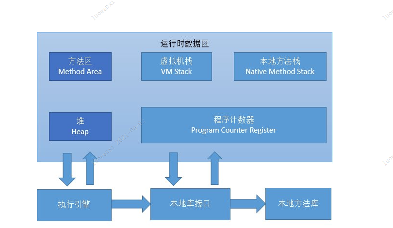

- [Java内存区域](#Java内存区域)
  - [程序计数器](#程序计数器)
  - [Java虚拟机栈](#Java虚拟机栈)
  - [本地方法栈](#本地方法栈)
  - [Java堆](#Java堆)
  - [方法区](#方法区)
  - [运行时常量池](#运行时常量池)
  - [直接内存](#直接内存)
- [虚拟机对象](#虚拟机对象)
  - [对象的创建](#对象的创建)
  - [对象的内存分布](#对象的内存分布)
    - [对象头](#对象头)
    - [实例数据](#实例数据)
    - [对齐填充](#对齐填充)
- [类文件结构](#类文件结构)
  - [Class类文件的结构](#Class类文件的结构)
  - [字节码指令](#字节码指令)
- [虚拟机类加载机制](#虚拟机类加载机制)
  - [类加载的时机](#类加载的时机)
  - [类加载的过程](#类加载的过程)
  - [类加载器](#类加载器有哪些)
    - [类与类加载器](#类与类加载器)  
    - [双亲委派机制](#双亲委派机制)  
    - [破坏双亲委派机制](#破坏双亲委派机制)
- [Java内存模型与线程](#Java内存模型与线程)
  - [Java内存模型](#Java内存模型)
    - [主内存和工作内存](#主内存和工作内存)
    - [volatile](#volatile)
  - [Java与线程](#Java与线程)
     - [线程的实现](#线程的实现)
     - [Java线程调度](#Java线程调度)
     - [Java线程状态和转换](#Java线程状态和转换)
- [线程安全和锁优化](#线程安全和锁优化)
  - [Java内存模型](#Java内存模型)
     - [Java线程安全](#Java线程安全)        
     - [线程安全的实现方法](#线程安全的实现方法)
  - [锁优化](#锁优化)
     - [自旋锁和自适应自旋](#自旋锁和自适应自旋)        
     - [锁消除](#锁消除)
     - [锁粗化](#锁粗化)
     - [轻量级锁](#轻量级锁)
     - [偏向锁](#偏向锁)
     
## Java内存区域

### 程序计数器

程序计数器（Program Counter Register）是一块较小的内存空间，它可以看作是当前线程所执行的字节码的行号指示器。字节码解释器工作的时候就是通过改变这个计数器的值来选取下一条需要执行的字节码指令，
它是程序控制流的指示器，分支、循环、跳转、异常处理、线程恢复等基础功能都需要依赖这个计数器来完成。

**特性**

- 在任何确定的时刻，一个处理器(对于多核处理器是一个内核)都只会执行一条线程中的指令；
- 每条线程都有一个独立的线程计数器，各条线程之间的计数器互不影响，独立存储；
- 如果执行的是Java方法，则这个计数器记录的是正在执行的虚拟机字节码指令的地址；
- 如果执行的是本地（Native）Native方法，计数器值为空(Undefined)；
- 此内存区域是唯一在《Java虚拟机规范》中没有规定任何OutOfMemoryError的区域。

### Java虚拟机栈

与程序计算器一样，Java虚拟机栈（Java Virtual Machine Stack）也是线程私有的，它的生命周期与线程相同。虚拟机栈描述的是Java方法执行的线程内存模型：每个方法都被执行的时候，Java虚拟机都会同步
创建一个栈帧（Stack Frame）用于存储局部变量表、操作数栈、动态链接、方法出口等信息、每一个方法被调用直到执行完毕的过程，就对应着一个栈帧在虚拟机栈中从入栈到出栈的过程。

**局部变量表**

局部变量表(Local Variable Table)是一组变量值存储空间，用于存放方法参数和方法内定义的局部变量。局部变量表的容量以变量槽(Variable Slot)为最小单位，Java虚拟机规范并没有定义一个槽所应该占用内存空间的大小，但是规定了一个槽应该可以存放一个32位以内的数据类型。　　

虚拟机通过索引定位的方法查找相应的局部变量，索引的范围是从0~局部变量表最大容量。如果Slot是32位的，则遇到一个64位数据类型的变量(如long或double型)，则会连续使用两个连续的Slot来存储。

局部变量表存放了编译期可知的各种基本数据类型(boolean、byte、char、short、int、float、long、double)、对象引用(reference类型) 和 returnAddress类型（它指向了一条字节码指令的地址）

**操作数栈**

操作数栈也常被称为操作栈，它是一个后入先出栈(LIFO)。同局部变量表一样，操作数栈的最大深度也是编译的时候被写入到方法表的Code属性的max_stacks数据项中。操作数栈的每一个元素可以是任意Java数据类型，包括long和double。32位数据类型所占的栈容量为1，64位数据类型所占的栈容量为2。栈容量的单位为“字宽”，对于32位虚拟机来说，一个”字宽“占4个字节，对于64位虚拟机来说，一个”字宽“占8个字节。

当一个方法刚刚执行的时候，这个方法的操作数栈是空的，在方法执行的过程中，会有各种字节码指向操作数栈中写入和提取值，也就是入栈与出栈操作。例如，在做算术运算的时候就是通过操作数栈来进行的，又或者调用其它方法的时候是通过操作数栈来行参数传递的。

**动态连接**

每个栈帧都包含一个指向运行时   常量池中（运行时常量池（Runtime Constant Pool）是方法区的一部分。）  该栈帧所属方法的引用，持有这个引用是为了支持方法调用过程中的动态连接（Dynamic Linking）。

在类加载阶段中的解析阶段会将符号引用转为直接引用，这种转化也称为静态解析。另外的一部分将在每一次运行时期转化为直接引用。这部分称为动态连接。

## 本地方法栈

- 本地方法栈（Native Method Stacks）与 Java 虚拟机栈所发挥的作用是非常相似的，其区别不过是虚拟机栈为虚拟机执行 Java 方法（也就是字节码）服务，而本地方法栈则是为虚拟机使用到的 Native 方法服务。
虚拟机规范中对本地方法栈中的方法使用的语言、使用方式与数据结构并没有强制规定，因此具体的虚拟机可以自由实现它。

- Native 方法是 Java 通过 JNI 直接调用本地 C/C++ 库，可以认为是 Native 方法相当于 C/C++ 暴露给 Java 的一个接口，Java 通过调用这个接口从而调用到 C/C++ 方法。当线程调用 Java 方法时，虚拟机
会创建一个栈帧并压入 Java 虚拟机栈。然而当它调用的是 native 方法时，虚拟机会保持 Java 虚拟机栈不变，也不会向 Java 虚拟机栈中压入新的栈帧，虚拟机只是简单地动态连接并直接调用指定的 native 方法。

- 本地方法栈是一个后入先出（Last In First Out）栈。

- 由于是线程私有的，生命周期随着线程，线程启动而产生，线程结束而消亡。

- 本地方法栈会抛出 StackOverflowError 和 OutOfMemoryError 异常。

## Java堆

Java堆是虚拟机所管理的内存中最大的一块，Java堆被所有线程共享的一块内存区域，在虚拟机启动时创建。堆的存在是为了存储对象实例，原则上讲，所有的对象都在堆区上分配内存（不过现代技术里，也不是这么绝对的，也有栈上直接分配的）。

**堆内存划分：**

堆大小 = 新生代 + 老年代。堆的大小可通过参数–Xms（堆的初始容量）、-Xmx（堆的最大容量） 来指定。

老生代：主要存放应用程序中生命周期长的内存对象。

老年代的对象比较稳定，所以MajorGC不会频繁执行。在进行MajorGC前一般都先进行了一次MinorGC，使得有新生代的对象晋身入老年代，导致空间不够用时才触发。当无法找到足够大的连续空间分配给新创建的较大对象时也会提前触发一次MajorGC进行垃圾回收腾出空间。

MajorGC采用标记—清除算法：首先扫描一次所有老年代，标记出存活的对象，然后回收没有标记的对象。MajorGC的耗时比较长，因为要扫描再回收。MajorGC会产生内存碎片，为了减少内存损耗，我们一般需要进行合并或者标记出来方便下次直接分配。

当老年代也满了装不下的时候，就会抛出OOM（Out of Memory）异常。

新生代 ( Young ) : 分为 Eden 和 两个 Survivor 区域，这两个 Survivor 区域分别被命名为 from 和 to，以示区分。默认的，Eden : from : to = 8 : 1 : 1 。(可以通过参数 –XX:SurvivorRatio 来设定 。
即： Eden = 8/10 的新生代空间大小，from = to = 1/10 的新生代空间大小。

JVM 每次只会使用 Eden 和其中的一块 Survivor 区域来为对象服务，所以无论什么时候，总是有一块 Survivor 区域是空闲着的。新生代实际可用的内存空间为 9/10 ( 即90% )的新生代空间。

- Eden区：Java新对象的出生地（如果新创建的对象占用内存很大，则直接分配到老年代）。当Eden区内存不够的时候就会触发MinorGC，对新生代区进行一次垃圾回收。
- From Survivor：保留了一次MinorGC过程中的幸存者。
- To Survivor：上一次GC的幸存者，作为这一次GC的被扫描者。

**堆的垃圾回收方式**

java堆是GC垃圾回收的主要区域。 GC分为两种： Minor GC、Full GC（也叫做Major GC）.

Minor GC(简称GC)

Minor GC是发生在新生代中的垃圾收集动作，所采用的是复制算法。GC一般为堆空间某个区发生了垃圾回收，新生代（Young）几乎是所有java对象出生的地方。即java对象申请的内存以及存放都是在这个地方。
java中的大部分对象通常不会长久的存活， 具有朝生夕死的特点。当一个对象被判定为“死亡”的时候， GC就有责任来回收掉这部分对象的内存空间。新生代是收集垃圾的频繁区域。

**回收过程如下：**

当对象在 Eden ( 包括一个 Survivor 区域，这里假设是 from 区域 ) 出生后，在经过一次 Minor GC 后，如果对象还存活，并且能够被另外一块 Survivor 区域所容纳(上面已经假设为 from 区域，
这里应为 to 区域，即 to 区域有足够的内存空间来存储 Eden 和 from 区域中存活的对象 )，则使用复制算法将这些仍然还存活的对象复制到另外一块 Survivor 区域 ( 即 to 区域 ) 中，然后清理所使用过的
 Eden 以及 Survivor 区域 ( 即 from 区域 )，并且将这些对象的年龄设置为1，以后对象在 Survivor 区每熬过一次 Minor GC，就将对象的年龄 + 1，当对象的年龄达到某个值时 ( 默认是 15 岁，可以通过
 参数 -XX:MaxTenuringThreshold 来设定 )，这些对象就会成为老年代。但这也不是一定的，对于一些较大的对象 ( 即需要分配一块较大的连续内存空间 ) 则是直接进入到老年代。
 
 Full GC
 
 Full GC 基本都是整个堆空间及持久代发生了垃圾回收，所采用的是标记-清除算法。
 现实的生活中，老年代的人通常会比新生代的人 “早死”。堆内存中的老年代(Old)不同于这个，老年代里面的对象几乎个个都是在 Survivor 区域中熬过来的，它们是不会那么容易就 “死掉” 了的。因此，Full GC 
 发生的次数不会有 Minor GC 那么频繁，并且做一次 Full GC 要比进行一次 Minor GC 的时间更长，一般是Minor GC的 10倍以上。
 
 另外，标记-清除算法收集垃圾的时候会产生许多的内存碎片 ( 即不连续的内存空间 )，此后需要为较大的对象分配内存空间时，若无法找到足够的连续的内存空间，就会提前触发一次 GC 的收集动作

## 方法区

### java对象头包含哪些内容

对象大致可以分为三个部分，分别是对象头、实例变量和填充字节

**对象头（Object header）**

- Mark Word：对象的Mark Word部分占4个字节，其内容是一系列的标记位，比如轻量级的标记位（00），偏向锁标记位（01）等等。
  用于存储对象自身的运行时数据，如哈希码（HashCode）、GC 分代年龄、锁状态标志、线程持有的锁、偏向线程 ID等。Mark Word
  被设计成一个非固定的数据结构以便在极小的空间内存储尽量多的信息，它会根据自己的状态复用自己的存储空间。 

- Class对象指针：Class对象指针的大小也是4个字节，其指向的位置是对象对应的Class对象（其对应的元数据对象）的内存地址。

**对象实际数据**

- 这里面包括了对象的所有成员变量，其大小由各个成员变量的大小决定，比如：byte和boolean是1个字节，short和char是2个字节，int和float是4个字节，long和double是8个字节，refrence是4个字节。

**对齐填充**

- 最后一部分是对齐填充的字节，按8个字节填充

## 虚拟机类加载机制

## 什么是双亲委派机制？

- 双亲委派模型的工作流程是：如果一个类加载器收到了类加载的请求，它首先不会自己去加载这个类，而是把请求委派给父加载器去完成，
依次向上，因此，所有的类加载请求最终都应该被传递到顶层的启动类加载器中，只有当父加载器没有找到所需的类时，子加载器才会尝试去加载该类。

**双亲委派机制:**

1、 当 AppClassLoader 加载一个 class 时，它首先不会自己去尝试加载这个类，而是把类加载请求委派给父类加载器 ExtClassLoader 去完成。

2、 当 ExtClassLoader 加载一个 class 时，它首先也不会自己去尝试加载这个类，而是把类加载请求委派给 BootStrapClassLoader 去完成。

3、 如果 BootStrapClassLoader 加载失败，会使用 ExtClassLoader 来尝试加载；

4、 若 ExtClassLoader 也加载失败，则会使用 AppClassLoader 来加载，如果 AppClassLoader 也加载失败，则会报出异常 ClassNotFoundException。

## 类加载的时机

遇到new, getstatic, putstatic, invokestatic这四条字节码指令的时候，如果类型还没有被初始化，则需要初始化。

new :实例化对象（对象实例调用表达式所创建的对象）

getstatic/putstatic: 读取/设置类的静态字段（被final修饰的静态常量除外）

invokestatic: 调用类的静态方法

## 类加载过程

## 类加载器有哪些？

JVM 中内置了三个重要的 ClassLoader，除了 BootstrapClassLoader 其他类加载器均由 Java 实现且全部继承自java.lang.ClassLoader：

- BootstrapClassLoader(启动类加载器) ：最顶层的加载类，由C++实现，负责加载 %JAVA_HOME%/lib目录下的jar包和类或者或被 -Xbootclasspath参数指定的路径中的所有类。
- ExtensionClassLoader(扩展类加载器) ：主要负责加载目录 %JRE_HOME%/lib/ext 目录下的jar包和类，或被 java.ext.dirs 系统变量所指定的路径下的jar包。
- AppClassLoader(应用程序类加载器) ：面向我们用户的加载器，负责加载当前应用classpath下的所有jar包和类。

## 如何查看 JVM 当前使用的是什么垃圾收集器？

-XX:+PrintCommandLineFlags 参数可以打印出所选垃圾收集器和堆空间大小等设置

如果开启了 GC 日志详细信息，里面也会包含各代使用的垃圾收集器的简称