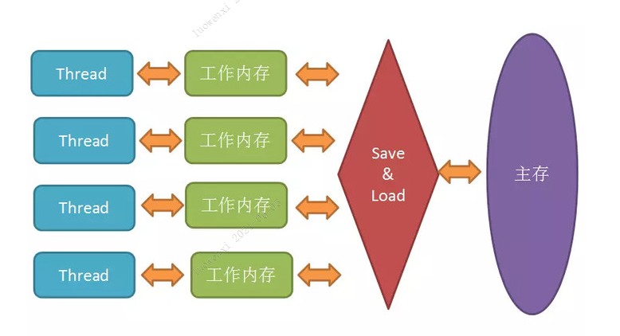
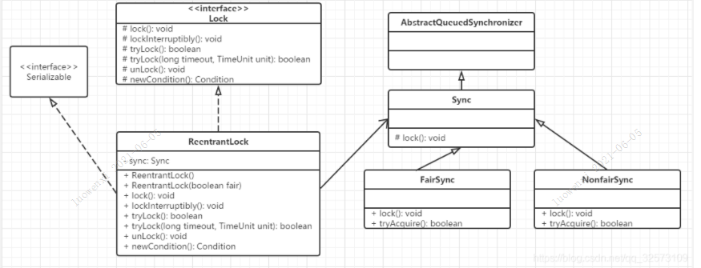
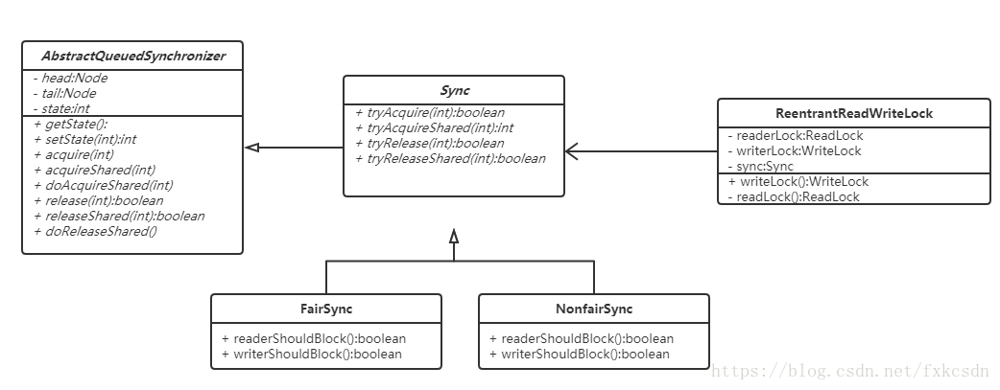
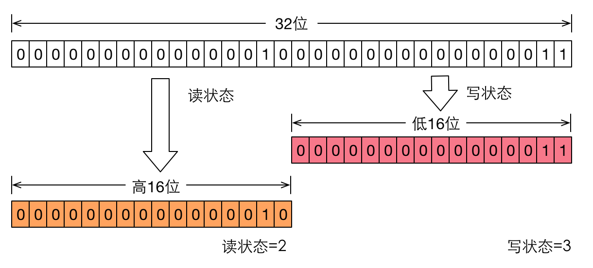
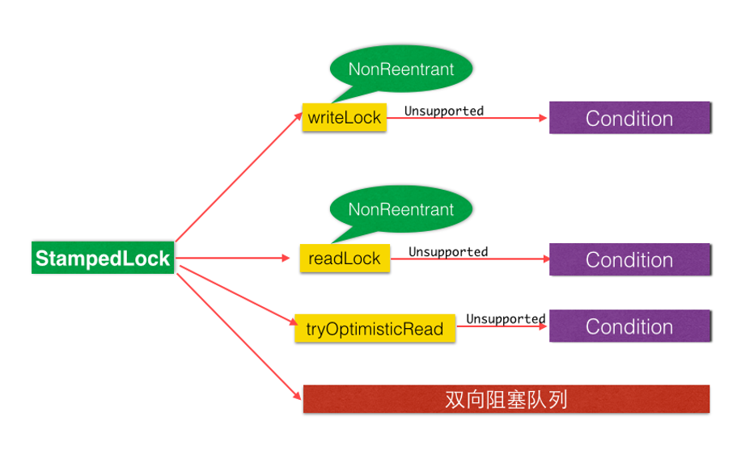

- [线程基础](#线程基础理解)
  - [进程和线程的区别](#进程和线程的区别)
  - [什么是上下文切换](#什么是上下文切换)
  - [如何减少上下文切换](#如何减少上下文切换)
  - [什么是线程死锁](#什么是线程死锁)
  - [如何预防线程死锁](#如何预防线程死锁)
  - [线程的创建方式](#线程的创建方式)
  - [Java线程具有六种状态](#Java线程具有六种状态)
  - [Object类中的wait方法](#Object类中的wait方法)
  - [Object类中的notify方法](#Object类中的notify方法)
  - [Java中sleep和wait的区别](#Java中sleep和wait的区别)
  - [Java中的synchronized原理](#synchronized实现原理)  
  - [synchronized锁升级过程](#synchronized锁升级过程)  
  - [Java中的volatile原理](#Java中的volatile原理)
  - [synchronized和volatile的区别](#synchronized和volatile的区别)
  - [Java中的CAS操作](#Java中的CAS操作)
  - [Java指令重排序](#Java指令重排序)
  - [锁的概述](#锁的概述)
    - [乐观锁和悲观锁区别](#乐观锁和悲观锁区别)
    - [什么是可重入锁](#什么是可重入锁)  
    - [什么是自旋锁](#什么是自旋锁)  
    - [公平锁和非公平锁的区别](#公平锁和非公平锁的区别)
    - [独占锁和共享锁的区别](#独占锁和共享锁的区别) 
- [JUC包下常用类](#JUC包下常用类)     
  - [ThreadLocalRandom](#ThreadLocalRandom)
  - [LongAdder](#LongAdder)
  - [LockSupport工具类](#LockSupport工具类)
  - [AQS原理](#AQS原理)
  - [ReentrantLock实现原理](#ReentrantLock实现原理)
     - [获取锁](#获取锁)
     - [释放锁](#释放锁)
  - [synchronized和ReentrantLock的区别](#synchronized和ReentrantLock的区别)
  - [ReentrantReadWriteLock原理](#ReentrantReadWriteLock原理)
  - [StampedLock的原理](#StampedLock的原理)
  - [ThreadLocal实现原理](#ThreadLocal实现原理)
- [ThreadPoolExecutor线程池](#ThreadPoolExecutor线程池)  
  - [Executors工具类](#Executors工具类)
  - [线程池状态含义](#线程池状态含义)
  - [线程池状态转换](#线程池状态转换)
  - [线程池参数](#线程池参数)
    - [拒绝策略](#拒绝策略)
  - [线程池类型](#线程池类型)
  - [线程池源码分析](#线程池源码分析)
- [Java并发包中线程同步器](#Java并发包中线程同步器)  
  - [CountDownLatch原理](#CountDownLatch原理)
  - [CyclicBarrier原理](#CyclicBarrier原理)
  - [Semaphore原理](#Semaphore原理)
- [Java并发包中的阻塞队列](#阻塞队列)  
  - [ConcurrentLinkedQueue原理](#ConcurrentLinkedQueue原理)
  - [LinkedBlockingQueue原理](#LinkedBlockingQueue原理)
  - [ArrayBlockingQueue原理](#ArrayBlockingQueue原理)
  - [PriorityBlockingQueue原理](#PriorityBlockingQueue原理)
  - [DelayQueue原理](#DelayQueue原理)
  - [SynchronousQueue](#SynchronousQueue)
  - [LinkedTransferQueue](#LinkedTransferQueue)


## 线程基础理解

### 进程和线程的区别

- 进程是代码在数据集合上的一次运行活动，是系统进行资源分配和调度的基本单元。

- 线程则是进程的执行路径，一个进程至少有一个线程，线程是CPU分配的基本单元。

### 什么是上下文切换?

多线程编程中一般线程的个数都大于 CPU 核心的个数，而一个 CPU 核心在任意时刻只能被一个线程使用，为了让这些线程都能得到有效执行，CPU 采取的策略是为每个线程分配时间片并轮转的形式。当一个线程的时间片用完的时候就会重新处于就绪状态让给其他线程使用，这个过程就属于一次上下文切换。

概括来说就是：当前任务在执行完 CPU 时间片切换到另一个任务之前会先保存自己的状态，以便下次再切换回这个任务时，可以再加载这个任务的状态。任务从保存到再加载的过程就是一次上下文切换。

上下文切换通常是计算密集型的。也就是说，它需要相当可观的处理器时间，在每秒几十上百次的切换中，每次切换都需要纳秒量级的时间。所以，上下文切换对系统来说意味着消耗大量的 CPU 时间，事实上，可能是操作系统中时间消耗最大的操作。

Linux 相比与其他操作系统（包括其他类 Unix 系统）有很多的优点，其中有一项就是，其上下文切换和模式切换的时间消耗非常少。

### 如何减少上下文切换

减少上下文切换的方法有无锁并发编程、CAS算法、使用最少线程和使用协程。

 1. 无锁并发并发编程。多线程竞争锁时，会引起上下文切换，所以多线程处理数据时，可以用一些办法来避免使用锁，如将数据的ID按照Hash算法取模分段，不同的线程处理不同段的数据。

 2. CAS算法。Java的Atomic包使用CAS算法来更新数据，而不需要加锁。

 3. 使用最少线程。避免创建不需要的线程，比如任务很少，但是创建了很多线程来处理，这样会造成大量线程都处于等待状态。

 4.协程：在单线程里实现多任务的调度，并在单线程里维持多个任务间的切换。

### 什么是线程死锁？

多个线程同时被阻塞，它们中的一个或者全部都在等待某个资源被释放。由于线程被无限期地阻塞，因此程序不可能正常终止。

产生死锁必须具备以下四个条件：

1. 互斥条件：该资源任意一个时刻只由一个线程占用。
1. 请求与保持条件：一个进程因请求资源而阻塞时，对已获得的资源保持不放。
1. 不剥夺条件:线程已获得的资源在末使用完之前不能被其他线程强行剥夺，只有自己使用完毕后才释放资源。
1. 循环等待条件:若干进程之间形成一种头尾相接的循环等待资源关系。

### 如何预防线程死锁?

我们只要破坏产生死锁的四个条件中的其中一个就可以了。

**破坏互斥条件**

这个条件我们没有办法破坏，因为我们用锁本来就是想让他们互斥的（临界资源需要互斥访问）。

**破坏请求与保持条件**

一次性申请所有的资源。

**破坏不剥夺条件**

占用部分资源的线程进一步申请其他资源时，如果申请不到，可以主动释放它占有的资源。

**破坏循环等待条件**

靠按序申请资源来预防。按某一顺序申请资源，释放资源则反序释放。破坏循环等待条件。

### 线程的创建方式

- 继承Thread类
- 实现runnable接口
- 实现callable接口，有返回值

实现 Runnable 和 Callable 接口的类只能当做一个可以在线程中运行的任务，不是真正意义上的线程，因此最后还需要通过 Thread 来调用。可以理解为任务是通过线程驱动从而执行的。

### 实现 Runnable 接口

需要实现接口中的 run() 方法。

```java
public class MyRunnable implements Runnable {
    @Override
    public void run() {
        // ...
    }
}
```

使用 Runnable 实例再创建一个 Thread 实例，然后调用 Thread 实例的 start() 方法来启动线程。

```java
public static void main(String[] args) {
    MyRunnable instance = new MyRunnable();
    Thread thread = new Thread(instance);
    thread.start();
}
```

### 实现 Callable 接口

与 Runnable 相比，Callable 可以有返回值，返回值通过 FutureTask 进行封装。

```java
public class MyCallable implements Callable<Integer> {
    public Integer call() {
        return 123;
    }
}
```

```java
public static void main(String[] args) throws ExecutionException, InterruptedException {
    MyCallable mc = new MyCallable();
    FutureTask<Integer> ft = new FutureTask<>(mc);
    Thread thread = new Thread(ft);
    thread.start();
    System.out.println(ft.get());
}
```

### 继承 Thread 类

同样也是需要实现 run() 方法，因为 Thread 类也实现了 Runable 接口。

当调用 start() 方法启动一个线程时，虚拟机会将该线程放入就绪队列中等待被调度，当一个线程被调度时会执行该线程的 run() 方法。

```java
public class MyThread extends Thread {
    public void run() {
        // ...
    }
}
```

```java
public static void main(String[] args) {
    MyThread mt = new MyThread();
    mt.start();
}
```

### Java线程具有六种状态

**1. 新建状态（New）**

当线程对象创建后即进入了新建状态，还没有调用start()方法

**2. 运行状态（Runnable）**  

包括操作系统线程状态中的Running和Ready。也就是处于此状态底下的线程有可能正在运行或者正在等在CPU分配时间片。

**3. 无限期等待（Waiting）**  

处于这种情况下的线程不会被cpu分配时间片，他们要等待其他线程的显式唤醒才可以。 

- 没有设置timeOut 参数的Object.wait()方法。
- 没有设置TimeOut参数的Thread.join()方法。
- LockSupport.park()方法。

**4. 限期等待（Timed waiting）**

处于这种状态的线程也不会被分配时间片。但是他无需其他线程唤醒，在一定的时间之后他们会被分配CPU执行的时间

- Thread::sleep()方法；
- 设置了Timeout参数的Object::wait方法；
- 设置了Timeout参数的Thread::join方法；
- LockSupport::parkNanos()；
- LockSupport::parkUtil()。

**5. 阻塞状态（Blocked）**  

程序等待进去同步区域的时候，线程进去这种状态。“阻塞状态”和“等待状态”的区别是“阻塞状态”在等待着获取到一个排它锁，这个事件将在另外一个线程放弃这个锁的时候发生；而“等待状态”

则是在等待一段时间，或者唤醒动作的发生。

**6. 结束（Terminated）**  

已终止线程的线程状态，线程已结束执行。

### Object类中的wait方法

当一个线程调用一个共享变量的wait方法时，调动线程会被阻塞挂起，直到发生了下面几件事情之一才返回：

1.其他线程调用了该共享对象的 notify() 或者 notify() 方法；

2.其他线程调用了该线程的 interrupt() 方法，该线程抛出 InterruptedException 异常返回。

注意：如果调用 wait() 方法的线程没有事先获取该对象的监视器锁（synchronized），则调用wait() 方法时，调用线程会抛出 IllegalMonitorException 异常。

**wait(long timeout)方法**

如果一个线程调用共享对象的该方法挂起后，没有在指定的 timeout ms 时间内内被其他线程调用该共享变量的 notify() 或者 notifyAll() 方法唤醒，那么该函数还是会因为超时而返回。

如果将 timeout 设置为 0 则和 无参的wait 方法效果一样，因为在 wait 方法内部就是调用了 wait(0)。需要注意的是，如果在调用该函数时，传递了一个负的 timeout 则会抛出 IllegalArgumentWException 异常。

### Object类中的notify方法

**notify()**

一个线程调用共享对象的 notify() 方法后，会唤醒一个在该共享变量上调用 wait 系列方法后被挂起的线程。一个共享变量上可能会有多个线程在等待，具体唤醒哪个等待的线程是随机的。

被唤醒的线程不能退马上从 wait 方法返回并继续执行，它必须在获取了共享对象的监视器锁后才可以返回，也就是唤醒它的线程释放了共享变量上的监视器锁后，被唤醒的线程也不一定会获取到共享对象的监视器锁，这是因为该线程还需要和其他线程一起竞争该锁，只有该线程竞争到了共享变量的监视器锁后才可以继续执行。

类似 wait 系列方法，只有当线程获取到了共享变量的监视器锁后，才可以调用共享变量的 notify() 方法，否则会抛出 IllegalMonitorStateException 异常

**notifyAll()**

不同于在共享变量上调用 notify() 函数会唤醒被阻塞到该共享变量上的一个线程，notifyAll() 方法则会唤醒所有在该共享变量上由于 wait 系列方法而被挂起的线程。

### Java中sleep和wait的区别

- sleep方法是Thread类的静态方法，wait方法是Object类的成员方法。  
- sleep方法不会释放lock，但是wait会释放lock，而且会加入等待队列中  
- sleep方法不依赖于同步器synchronized，但是wait需要依赖synchronized关键字  
- sleep方法有可能会抛出异常，所以需要进行异常处理；wait方法不需要处理  
- sleep方法可以在任何地方使用；wait方法只能在同步方法和同步代码块中使用  

### synchronized实现原理

**1. 作用**  

原子性：确保线程互斥的访问同步代码；

可见性：保证共享变量的修改能够及时可见，其实是通过Java内存模型中的 “对一个变量unlock操作之前，必须要同步到主内存中；如果对一个变量进行lock操作，则将会清空工作内存中此变量的值，在执行引擎使用此变量前，需要重新从主内存中load操作或assign操作初始化变量值” 来保证的；

有序性：有效解决重排序问题，即 “一个unlock操作先行发生(happen-before)于后面对同一个锁的lock操作”；

**2. 三种用法** 

当synchronized作用在实例方法时，监视器锁（monitor）便是对象实例（this）；

当synchronized作用在静态方法时，监视器锁（monitor）便是对象的Class实例，因为Class数据存在于永久代，因此静态方法锁相当于该类的一个全局锁；

当synchronized作用在同步代码块时，监视器锁（monitor）便是括号括起来的对象实例；

**3. 实现原理**  
 
- **synchronized修饰代码块：**

```java
public void method() {
        synchronized (this) {
            System.out.println("synchronized 代码块");
        }
}
```

synchronized 同步代码块的实现使用的是 monitorenter 和 monitorexit 指令，其中 monitorenter 指令指向同步代码块的开始位置，monitorexit 指令则指明同步代码块的结束位置。

当执行 monitorenter 指令时，线程试图获取锁也就是获取 对象监视器 monitor 的持有权。

在执行monitorenter时，会尝试获取对象的锁，如果锁的计数器为 0 则表示锁可以被获取，获取后将锁计数器设为 1 也就是加 1。

在执行 monitorexit 指令后，将锁计数器设为 0，表明锁被释放。如果获取对象锁失败，那当前线程就要阻塞等待，直到锁被另外一个线程释放为止。

在 Java 虚拟机(HotSpot)中，Monitor 是基于 C++实现的，由ObjectMonitor实现的。每个对象中都内置了一个 ObjectMonitor对象。

另外，wait/notify等方法也依赖于monitor对象，这就是为什么只有在同步的块或者方法中才能调用wait/notify等方法，否则会抛出java.lang.IllegalMonitorStateException的异常的原因。

- **synchronized修饰方法**

```java
 public synchronized void method() {
        System.out.println("synchronized 方法");
}
```

synchronized方法同步不再是通过插入monitorentry和monitorexit指令实现，而是由方法调用指令来读取运行时常量池中的ACC_SYNCHRONIZED标志隐式实现的，如果方法表结构（method_info Structure）中的ACC_SYNCHRONIZED标志被设置，
那么线程在执行方法前会先去获取对象的monitor对象，如果获取成功则执行方法代码，执行完毕后释放monitor对象，如果monitor对象已经被其它线程获取，那么当前线程被阻塞。

### synchronized锁升级过程

在Java Se1.6中，锁的4中状态：无锁状态、偏向锁状态、轻量级锁状态、重量级锁状态（级别从低到高）。

**1. 偏向锁**

为什么要引入偏向锁？

因为经过HotSpot的作者大量的研究发现，大多数时候是不存在锁竞争的，常常是一个线程多次获得同一个锁，因此如果每次都要竞争锁会增大很多没有必要付出的代价，为了降低获取锁的代价，才引入的偏向锁。

（1）偏向锁的升级

当线程1访问同步代码块并获取锁对象时，会在java对象头和栈帧中记录偏向的锁的threadID，因为偏向锁不会主动释放锁，因此以后线程1再次获取锁的时候，需要比较当前线程的threadID和Java对象头中的threadID是否一致，

如果一致（还是线程1获取锁对象），则无需使用CAS来加锁、解锁；如果不一致（其他线程，如线程2要竞争锁对象，而偏向锁不会主动释放因此还是存储的线程1的threadID），那么需要查看Java对象头中记录的线程1是否存活，

如果没有存活，那么锁对象被重置为无锁状态，其它线程（线程2）可以竞争将其设置为偏向锁；如果存活，那么立刻查找该线程（线程1）的栈帧信息，如果还是需要继续持有这个锁对象，那么暂停当前线程1，撤销偏向锁，升级为轻量级锁，

如果线程1 不再使用该锁对象，那么将锁对象状态设为无锁状态，重新偏向新的线程。

（2）偏向锁的取消

偏向锁是默认开启的，而且开始时间一般是比应用程序启动慢几秒，如果不想有这个延迟，那么可以使用-XX:BiasedLockingStartUpDelay=0；

如果不想要偏向锁，那么可以通过-XX:-UseBiasedLocking = false来设置；

**2. 轻量级锁自旋锁）**

为什么要引入轻量级锁？

轻量级锁考虑的是竞争锁对象的线程不多，而且线程持有锁的时间也不长的情景。因为阻塞线程需要CPU从用户态转到内核态，代价较大，如果刚刚阻塞不久这个锁就被释放了，那这个代价就有点得不偿失了，因此这个时候就干脆不阻塞这个线程，让它自旋这等待锁释放。

轻量级锁什么时候升级为重量级锁？

线程1获取轻量级锁时会先把锁对象的对象头MarkWord复制一份到线程1的栈帧中创建的用于存储锁记录的空间（称为DisplacedMarkWord），然后使用CAS把对象头中的内容替换为线程1存储的锁记录（DisplacedMarkWord）的地址；

如果在线程1复制对象头的同时（在线程1CAS之前），线程2也准备获取锁，复制了对象头到线程2的锁记录空间中，但是在线程2CAS的时候，发现线程1已经把对象头换了，线程2的CAS失败，那么线程2就尝试使用自旋锁来等待线程1释放锁。

但是如果自旋的时间太长也不行，因为自旋是要消耗CPU的，因此自旋的次数是有限制的，比如10次或者100次，如果自旋次数到了线程1还没有释放锁，或者线程1还在执行，线程2还在自旋等待，这时又有一个线程3过来竞争这个锁对象，那么这个时候轻量级锁就会膨胀为重量级锁。重量级锁把除了拥有锁的线程都阻塞，防止CPU空转。

**3. 重量级锁**

当一个锁被两条或两条以上的线程竞争的时候，这时候轻量级锁就会演变成重量级锁。

重量级锁也就是通常说synchronized的对象锁，锁标识位为10，其中指针指向的是monitor对象（也称为管程或监视器锁）的起始地址。每个对象都存在着一个 monitor 与之关联，对象与其 monitor 之间的关系有存在多种实现方式，如monitor可以与对象一起创建销毁或当线程试图获取对象锁时自动生成，但当一个 monitor 被某个线程持有后，它便处于锁定状态。

## Java中的volatile原理



如果对声明了volatile的变量进行写操作，JVM就会向处理器发送一条Lock前缀的指令，将这个变量所在缓存行的数据写回到系统内存；

一个处理器的缓存回写到内存会导致其他处理器的缓存无效。

**1. 保证内存可见性**

- 当写一个volatile变量时，JMM会把该线程本地内存中的变量强制刷新到主内存中去；

- 这个写会操作会导致其他线程中的volatile变量缓存无效。

**2. 禁止指令重排序**

volatile是通过编译器在生成字节码时，在指令序列中添加“内存屏障”来禁止指令重排序的。

说明：volatile并不能保证原子性

### synchronized和volatile的区别？

一旦一个共享变量（类的成员变量、类的静态成员变量）被volatile修饰之后，那么就具备了两层语义：   

1.保证了不同线程对这个变量进行操作时的可见性，即一个线程修改了某个变量的值，这新值对于其他线程来说是立即可见的。  

2.禁止进行指令重排序。

volatile本质是在告诉jvm当前变量在寄存器（工作内存）中的值是不确定的，需要从主存中读取；synchronized则是锁定当前变量，只有当前线程可以访问该变量，其他线程被阻塞住。  

- volatile仅能使用在变量级别；synchronized则可以使用在变量、方法、和类级别的。  
- volatile仅能实现变量的修改可见性，并不能保证原子性；synchronized则可以保证变量的修改可见性和原子性，但synchronized 不能防止指令重排序 。  
- volatile不会造成线程的阻塞；synchronized可能会造成线程的阻塞。  
- volatile标记的变量不会被编译器优化；synchronized标记的变量可以被编译器优化。  

### Java中的CAS操作

CAS（Compare and Swap），JDK提供的非阻塞原子性操作，通过硬件保证了比较-更新操作的原子性。JDK里面的Unsafe类提供了一系列compareAndSwap*方法

```java
public final native boolean compareAndSwapObject(Object var1, long var2, Object var4, Object var5);

public final native boolean compareAndSwapInt(Object var1, long var2, int var4, int var5);

public final native boolean compareAndSwapLong(Object var1, long var2, long var4, long var6);

```
CAS有四个操作数，分别为：对象内存位置、对象中的变量的偏移量、变量预期值和新的值。

**ABA问题**

线程1首先获取变量X的值为A，然后使用CAS操作修改为B。在执行CAS之前，线程2修改了X的值为B，又改为A。所以线程1执行CAS时X的值为A，但这个A以及不是线程1获取时的A了。

ABA问题的产生是因为变量的状态值发生了环形转换，A -> B -> A。如果变量的值只能朝着一个方向转换，A -> B -> C，不能构成环形，就不会存在问题。

JDK中的AtomicStampedReference类给每个变量的状态值都配备了一个时间戳，从而避免了ABA问题。

### Java指令重排序

## 锁的概述

### 乐观锁和悲观锁区别

- 乐观锁：乐观锁认为竞争不总是会发生，因此它不需要持有锁，将比较-替换这两个动作作为一个原子操作尝试去修改内存中的变量，如果失败则表示发生冲突，那么就应该有相应的重试逻辑。
- 悲观锁：悲观锁认为竞争总是会发生，因此每次对某资源进行操作时，都会持有一个独占的锁，就像synchronized，不管三七二十一，直接上了锁就操作资源了。

### 什么是可重入锁？

一个线程已经获取锁时再次获取锁不会对其自身进行阻塞的锁叫做可重入锁。

##% 什么是自旋锁？

自旋锁（spinlock）：是指当一个线程在获取锁的时候，如果锁已经被其它线程获取，那么该线程将循环等待，然后不断的判断锁是否能够被成功获取，直到获取到锁才会退出循环。

自旋锁是使用CPU时间缓存线程阻塞与调度的开销。

### 公平锁和非公平锁的区别

- 公平锁：多个线程按照申请锁的顺序去获得锁，线程会直接进入队列去排队，永远都是队列的第一位才能得到锁。

优点：所有的线程都能得到资源，不会饿死在队列中。
缺点：吞吐量会下降很多，队列里面除了第一个线程，其他的线程都会阻塞，cpu唤醒阻塞线程的开销会很大。

- 非公平锁：多个线程去获取锁的时候，会直接去尝试获取，获取不到，再去进入等待队列，如果能获取到，就直接获取到锁。

优点：可以减少CPU唤醒线程的开销，整体的吞吐效率会高点，CPU也不必取唤醒所有线程，会减少唤起线程的数量。
缺点：你们可能也发现了，这样可能导致队列中间的线程一直获取不到锁或者长时间获取不到锁，导致饿死

### 独占锁和共享锁的区别

- 独占锁也叫排他锁，是指该锁一次只能被一个线程所持有。如果线程T对数据A加上排他锁后，则其他线程不能再对A加任何类型的锁。获得排它锁的线程即能读数据又能修改数据。JDK中的synchronized和 JUC中Lock的实现类就是互斥锁。

- 共享锁是指该锁可被多个线程所持有。如果线程T对数据A加上共享锁后，则其他线程只能对A再加共享锁，不能加排它锁。获得共享锁的线程只能读数据，不能修改数据。 独享锁与共享锁也是通过AQS来实现的，通过实现不同的方法，来实现独享或者共享。

## JUC包下常用类

### ThreadLocalRandom

### LongAdder

### AQS原理

### ReentrantLock实现原理

ReentrantLock是基于AQS实现可重入的独占锁，同时只能有一个线程可以获取该锁，其他获取该锁的线程会被阻塞而放入该锁的AQS阻塞队列里面。



ReentrantLock是使用AQS来实现的，并且根据参数来决定内部是一个公平锁还是非公平锁，默认是非公平锁。

```java
    /**
     * Creates an instance of {@code ReentrantLock}.
     * This is equivalent to using {@code ReentrantLock(false)}.
     */
    public ReentrantLock() {
        sync = new NonfairSync();
    }

    /**
     * Creates an instance of {@code ReentrantLock} with the
     * given fairness policy.
     *
     * @param fair {@code true} if this lock should use a fair ordering policy
     */
    public ReentrantLock(boolean fair) {
        sync = fair ? new FairSync() : new NonfairSync();
    }
```

ReentrantLock里面的Sync类直接继承AQS，它的子类NonfairSync和FairSync分别实现了获取锁的非公平和公平策略。

在这里，AQS的state状态值表示线程获取该锁的可重入次数，在默认情况下，state的值为0表示当前锁没有被任何线程持有。当一个线程第一次获取该锁时会尝试使用CAS设置state的值为1，如果CAS成功则当前线程
获取了该锁，然后记录改锁的持有者为当前线程。在该线程没有释放锁的情况下第二次获取该锁后，状态值被设置为2，这就是可重入次数。在该线程释放该锁时，会尝试使用CAS让状态值减1，如果减1后状态值为0，则当
前线程释放该锁。

#### 获取锁

**1. void lock()**

当一个线程调用该方法时，说明该线程希望获取该锁。如果该锁当前没有被其他线程占用，并且当前线程之前没有获取过该锁，则当前线程会获取到该锁，然后设置当前锁的拥有者为当前线程，并设置AQS的状态值为1，
然后直接返回。如果当前线程之前已经获取过该锁，则这次只是简单地把AQS的状态值加1后返回。如果该锁已经被其他线程持有，则调用该方法的线程会被放入AQS阻塞队列后挂起。

```java
public void lock() {
    sync.lock();
}
```

在如上代码中，ReentrantLock的lock()委托给了Sync类，根据创建ReentrantLock构造函数选择Sync的实现是NonfairSync还是FairSync，这个锁是一个非公平锁或者公平锁。

下面代码是NonfairSync的lock()，也就是非公平锁

```java
 final void lock() {
     // CAS设置状态值，从0变为1
     if (compareAndSetState(0, 1))
     	 // 如果设置成功，则设置该锁的持有者是当前线程
         setExclusiveOwnerThread(Thread.currentThread());
     else
         // 否则调用AQS的acquire方法
         acquire(1);
 }
```

如上代码，默认ASQ的状态值为0，所以第一个调用Lock的线程会通过CAS设置状态值为1，CAS成功则表示当前线程获取到了锁，然后setExclusiveOwnerThread设置该锁持有者是当前线程。

如果这时候有其他线程调用lock方法企图获取该锁，CAS会失败，然后会调用AQS的acquire方法。

```java
public final void acquire(int arg) {
    // 调用Sync重写的tryAcquire
    if (!tryAcquire(arg) &&
        // tryAcquirea放回false会把当前线程fangruAQS阻塞队列
        acquireQueued(addWaiter(Node.EXCLUSIVE), arg))
        selfInterrupt();
}
```

AQS并没有提供可用的tryAcquire方法，tryAcquire方法需要子类自己实现，下面是tryAcquire

```java
 protected final boolean tryAcquire(int acquires) {
     return nonfairTryAcquire(acquires);
 }

 // 注意acquires的值为1
 final boolean nonfairTryAcquire(int acquires) {
     // 获取当前线程
     final Thread current = Thread.currentThread();
     // 获取此时state的值
     int c = getState();
     // 如果state的值为1
     if (c == 0) {
     	 // CAS设置state的值，从0变为1
         if (compareAndSetState(0, acquires)) {
             // 设置该锁的持有者是当前线程
             setExclusiveOwnerThread(current);
             return true;
         }
     }
     // 如果该锁的持有者是当前线程
     else if (current == getExclusiveOwnerThread()) {
         // 简单的将state加1
         int nextc = c + acquires;
         // 注意精度溢出
         if (nextc < 0) // overflow
             throw new Error("Maximum lock count exceeded");
         setState(nextc);
         return true;
     }
     // 如果state不为0
     // 如果当前线程不是锁持有者
     // 满足以上两种情况，就返回false
     return false;
 }
```
 
 简单的流程串一下，首先获取当前线程，查看当前锁的状态是否为0，为0则说明当前该锁空闲，那么就尝试CAS获取该锁，将AQS的state从0设置为1，并设置当前锁的持有者为当前线程，然后返回true。
 如果当前state不为0，则说明该锁已经被某个线程所持有，素有查看当前线程是否是该锁的持有者，如果当前线程是该锁的持有者，则state加1，然后返回true。需要注意的一点，nextc<0说明可重入次数溢出了。
 如果当前线程不是锁的持有者则返回false，然后会被加入AQS阻塞队列。
 
 公平锁：
 
 ```java
 // 同样，acquires的值为1
  protected final boolean tryAcquire(int acquires) {
      // 获取当前线程
      final Thread current = Thread.currentThread();
      // 获取当前的state
      int c = getState();
      // 如果当前state为0
      if (c == 0) {
          // 公平性策略
          if (!hasQueuedPredecessors() &&
              compareAndSetState(0, acquires)) {
              setExclusiveOwnerThread(current);
              return true;
          }
      }
      // 当前线程是锁的持有者
      else if (current == getExclusiveOwnerThread()) {
          int nextc = c + acquires;
          if (nextc < 0)
              throw new Error("Maximum lock count exceeded");
          setState(nextc);
          return true;
      }
      return false;
  }
  
```
如上代码，公平的tryAcquire策略与非公平的类似，不同之处在设置CAS前添加了hasQueuedPredecessors方法，该方法是实现公平性的核心代码，代码如下：

```java
public final boolean hasQueuedPredecessors() {
    Node t = tail; // Read fields in reverse initialization order
    Node h = head;
    Node s;
    return h != t &&
        ((s = h.next) == null || s.thread != Thread.currentThread());
}
```

在如上代码中：

- 如果h==t，说明当前队列为空，返回fasle
- 如果h!=t并且s==null，说明有一个元素要作为AQS的第一个结点入队列（之前也了解过，第一个结点入队列的时候，会创建一个哨兵结点，然后将第一个结点插到哨兵结点的后面），返回true
- 如果h!=t并且s！=null，此时 s.thread != Thread.currentThread()，则说明队列里面的第一个元素不是当前线程，那么返回true

**2. void lockInterruptibly()方法**

与lock()方法类似，不同之处在于，它对中断进行响应，就是当前线程在调用该方法时，如果其他方法调用了当前线程的interrupt()方法时，则当前线程会抛出InterruptedException异常，然后返回。

```java
public void lockInterruptibly() throws InterruptedException {
     sync.acquireInterruptibly(1);
 }

public final void acquireInterruptibly(int arg)
       throws InterruptedException {
   // 如果当前线程被中断，直接抛出异常
   if (Thread.interrupted())
       throw new InterruptedException();
   if (!tryAcquire(arg))
       // 调用AQS中可以被中断的方法
       doAcquireInterruptibly(arg);
}
```

**3. boolean tryLock()方法**

尝试获取锁，如果当前该锁没有被其他线程持有，则当前线程获取该锁并返回true，否则返回false。该方法不会引用当前线程阻塞。

```java
public boolean tryLock() {
    return sync.nonfairTryAcquire(1);
}

final boolean nonfairTryAcquire(int acquires) {
    final Thread current = Thread.currentThread();
    int c = getState();
    if (c == 0) {
        if (compareAndSetState(0, acquires)) {
            setExclusiveOwnerThread(current);
            return true;
        }
    }
    else if (current == getExclusiveOwnerThread()) {
        int nextc = c + acquires;
        if (nextc < 0) // overflow
            throw new Error("Maximum lock count exceeded");
        setState(nextc);
        return true;
    }
    return false;
}
```

如上代码，可以看出，调用了sync的nonfairTryAcquire，所以tryLock()采用的是非公平策略。

**4. boolean tryLock(long timeout,TimeUnit unit)方法**

```java
尝试获取锁，与tryLock()的不同之处在于，它设置了超时时间，如果超时时间到了没有获取到锁，就返回false。

public boolean tryLock(long timeout, TimeUnit unit)
        throws InterruptedException {
    // 调用AQS的tryAcquireNanos
    return sync.tryAcquireNanos(1, unit.toNanos(timeout));
}

public final boolean tryAcquireNanos(int arg, long nanosTimeout)
        throws InterruptedException {
    if (Thread.interrupted())
        throw new InterruptedException();
    return tryAcquire(arg) ||
        doAcquireNanos(arg, nanosTimeout);
}

// AQS的doAcquireNanos方法
private boolean doAcquireNanos(int arg, long nanosTimeout)
        throws InterruptedException {
    if (nanosTimeout <= 0L)
        return false;
    // 获取超时的绝对时间
    final long deadline = System.nanoTime() + nanosTimeout;
    final Node node = addWaiter(Node.EXCLUSIVE);
    boolean failed = true;
    try {
        for (;;) {
            final Node p = node.predecessor();
            if (p == head && tryAcquire(arg)) {
                setHead(node);
                p.next = null; // help GC
                failed = false;
                return true;
            }
            // 计算剩余时间
            nanosTimeout = deadline - System.nanoTime();
            if (nanosTimeout <= 0L)
                return false;
            // spinForTimeoutThreshold是静态常量，1000
            if (shouldParkAfterFailedAcquire(p, node) &&
                nanosTimeout > spinForTimeoutThreshold)
                // 挂起nanosTimeout后返回
                LockSupport.parkNanos(this, nanosTimeout);
            if (Thread.interrupted())
                throw new InterruptedException();
        }
    } finally {
        if (failed)
            cancelAcquire(node);
    }
}
```

#### 释放锁

**1. unlock()**

尝试释放锁，如果当前线程持有锁，则调用该方法让该线程AQS对state减1，如果减1后，当前state为0，则当前线程会释放该锁，否则仅仅是减1。
如果当前线程没有持有该锁，而调用了该方法，则会抛出IllegalMonitorStateException异常。

```java
public void unlock() {
     // 调用AQS的release
     sync.release(1);
 }

// AQS的release
public final boolean release(int arg) {
    if (tryRelease(arg)) {
        Node h = head;
        if (h != null && h.waitStatus != 0)
            unparkSuccessor(h);
        return true;
    }
    return false;
}

// Sync重写的tryRelease  releases为1
protected final boolean tryRelease(int releases) {
   int c = getState() - releases;
   // 如果不是锁持有者调用unlock，则抛出异常
   if (Thread.currentThread() != getExclusiveOwnerThread())
       throw new IllegalMonitorStateException();
   boolean free = false;
   // 如果当前可重入次数为0，则清空锁持有线程
   if (c == 0) {
       free = true;
       setExclusiveOwnerThread(null);
   }
   // 设置可重入次数为原始值-1
   setState(c);
   return free;
}
```

### synchronized和ReentrantLock的区别

- synchronized 是依赖于 JVM 实现的，ReentrantLock 是 JDK 的 API 层面；
- ReentrantLock可以指定是公平锁还是非公平锁。而synchronized只能是非公平锁；
- synchronized 不需要用户去手动释放锁，synchronized 代码执行完后系统会自动让线程释放对锁的占用； ReentrantLock则需要用户去手动释放锁，如果没有手动释放锁，就可能导致死锁现象；
- ReentrantLock提供了一种能够中断等待锁的线程的机制，通过 lock.lockInterruptibly() 来实现这个机制，synchronized不可中断；
- 一个ReentrantLock可以绑定多个Condition对象，仅需多次调用new Condition()即可；而在synchronized中锁锁对象的wait()、notify()/notifyAll()可以实现一个隐含的条件，如果要和多余的条件关联，就不得不额外的增加一个锁

### ReentrantReadWriteLock的原理

ReadLock和WriteLock是ReentrantReadWriteLock的两个内部类，Lock的上锁和释放锁都是通过AQS来实现的。




AQS定义了独占模式的acquire()和release()方法，共享模式的acquireShared()和releaseShared()方法.还定义了抽象方法tryAcquire()、tryAcquiredShared()、tryRelease()和tryReleaseShared()由子类实现，tryAcquire()和tryAcquiredShared()分别对应独占模式和共享模式下的锁的尝试获取，就是通过这两个方法来实现公平性和非公平性，在尝试获取中，如果新来的线程必须先入队才能获取锁就是公平的，否则就是非公平的。这里可以看出AQS定义整体的同步器框架，具体实现放手交由子类实现。

ReadLock和WriteLock方法都是通过调用Sync的方法实现的，所以我们先来分析一下Sync源码：

AQS 的状态state是32位（int 类型）的，辦成两份，读锁用高16位，表示持有读锁的线程数（sharedCount），写锁低16位，表示写锁的重入次数 （exclusiveCount）。状态值为 0 表示锁空闲，sharedCount不为 0 表示分配了读锁，exclusiveCount 不为 0 表示分配了写锁，sharedCount和exclusiveCount 一般不会同时不为 0，只有当线程占用了写锁，该线程可以重入获取读锁，反之不成立。



### StampedLock的原理

StampedLock是JUC并发包里面JDK1.8版本新增的一个锁，该锁提供了三种模式的读写控制，当调用获取锁的系列函数的时候，会返回一个long 型的变量，该变量被称为戳记（stamp),这个戳记代表了锁的状态。

try系列获取锁的函数，当获取锁失败后会返回为0的stamp值。当调用释放锁和转换锁的方法时候需要传入获取锁时候返回的stamp值。

StampedLock的内部实现是基于CLH锁的，CLH锁原理：锁维护着一个等待线程队列，所有申请锁且失败的线程都记录在队列。一个节点代表一个线程，保存着一个标记位locked,用以判断当前线程是否已经释放锁。当一个线程试图获取锁时，从队列尾节点作为前序节点，循环判断所有的前序节点是否已经成功释放锁。




```java
private static final long serialVersionUID = -6001602636862214147L;

    /** 获取服务器CPU核数 */
    private static final int NCPU = Runtime.getRuntime().availableProcessors();

    /** 线程入队列前自旋次数 */
    private static final int SPINS = (NCPU > 1) ? 1 << 6 : 0;

    /** 队列头结点自旋获取锁最大失败次数后再次进入队列 */
    private static final int HEAD_SPINS = (NCPU > 1) ? 1 << 10 : 0;

    /** 重新阻塞前的最大重试次数 */
    private static final int MAX_HEAD_SPINS = (NCPU > 1) ? 1 << 16 : 0;

    /** The period for yielding when waiting for overflow spinlock */
    private static final int OVERFLOW_YIELD_RATE = 7; // must be power 2 - 1

    /** 溢出之前用于阅读器计数的位数 */
    private static final int LG_READERS = 7;

    // 锁定状态和stamp操作的值
    private static final long RUNIT = 1L; // 每次获取读锁 进行+1
    private static final long WBIT  = 1L << LG_READERS;  //写状态 1000 0000
    private static final long RBITS = WBIT - 1L;  //溢出保护 0111 1111
    private static final long RFULL = RBITS - 1L; //最大读线程数 0111 1110
    private static final long ABITS = RBITS | WBIT;   // 掩码 前8位都为1  1111 1111
    private static final long SBITS = ~RBITS; // 掩码 1... 1000 0000

    //锁state初始值，第9位为1，避免算术时和0冲突
    private static final long ORIGIN = WBIT << 1;

    // 来自取消获取方法的特殊值，因此调用者可以抛出IE
    private static final long INTERRUPTED = 1L;

    // WNode节点的status值
    private static final int WAITING   = -1;
    private static final int CANCELLED =  1;

    // WNode节点的读写模式
    private static final int RMODE = 0;
    private static final int WMODE = 1;

    /** Wait nodes */
    static final class WNode {
        volatile WNode prev;
        volatile WNode next;
        volatile WNode cowait;    // 读模式使用该节点形成栈
        volatile Thread thread;   // non-null while possibly parked
        volatile int status;      // 0, WAITING, or CANCELLED
        final int mode;           // RMODE or WMODE
        WNode(int m, WNode p) { mode = m; prev = p; }
    }

    /** CLH队头节点 */
    private transient volatile WNode whead;
    /** CLH队尾节点 */
    private transient volatile WNode wtail;

    // views
    transient ReadLockView readLockView;
    transient WriteLockView writeLockView;
    transient ReadWriteLockView readWriteLockView;

    /** 锁队列状态， 当处于写模式时第8位为1，读模式时前7为为1-126（附加的readerOverflow用于当读者超过126时） */
    private transient volatile long state;
    /** 将state超过 RFULL=126的值放到readerOverflow字段中 */
    private transient int readerOverflow;

```


### ThreadLocal实现原理

ThreadLocal被称作线程局部变量，当我们定义了一个ThreadLocal变量，所有的线程共同使用这个变量，但是对于每一个线程来说，实际操作的值是互相独立的。

**原理**

每一个线程都有一个对应的Thread对象，而Thread类有一个成员变量，它是一个Map集合，这个Map集合的key就是ThreadLocal的引用，而value就是当前线程在key所对应的ThreadLocal中存储的值。
当某个线程需要获取存储在ThreadLocal变量中的值时，ThreadLocal底层会获取当前线程的Thread对象中的Map集合，然后以ThreadLocal作为key，从Map集合中查找value值。这就是ThreadLocal实现线程独立的原理。

## ThreadPoolExecutor线程池

### Executors工具类

Executors其实是个工具类，里面提供了好多静态方法，根据用户选择返回不同的线程池实例。ThreadPoolExecutor继承了AbstractExecutorService，成员变量ctl是个Integer的原子变量用来记录线程池状态 和 线程池线程个数，类似于ReentrantReadWriteLock使用一个变量存放两种信息。

这里假设Integer类型是32位二进制标示，其中高3位用来表示线程池状态，后面 29位用来记录线程池线程个数。

```java
//用来标记线程池状态（高3位），线程个数（低29位）
//默认是RUNNING状态，线程个数为0

private final AtomicInteger ctl = new AtomicInteger(ctlOf(RUNNING, 0));

//线程个数掩码位数
private static final int COUNT_BITS = Integer.SIZE - 3;

//线程最大个数(低29位)00011111111111111111111111111111
private static final int CAPACITY   = (1 << COUNT_BITS) - 1;

//（高3位）：11100000000000000000000000000000
private static final int RUNNING    = -1 << COUNT_BITS;

//（高3位）：00000000000000000000000000000000
private static final int SHUTDOWN   =  0 << COUNT_BITS;

//（高3位）：00100000000000000000000000000000
private static final int STOP       =  1 << COUNT_BITS;

//（高3位）：01000000000000000000000000000000
private static final int TIDYING    =  2 << COUNT_BITS;

//（高3位）：01100000000000000000000000000000
private static final int TERMINATED =  3 << COUNT_BITS;

// 获取高三位 运行状态
private static int runStateOf(int c)     { return c & ~CAPACITY; }

//获取低29位 线程个数
private static int workerCountOf(int c)  { return c & CAPACITY; }

//计算ctl新值，线程状态 与 线程个数
private static int ctlOf(int rs, int wc) { return rs | wc; }

```

### 线程池状态含义

- RUNNING：接受新任务并且处理阻塞队列里的任务
- SHUTDOWN：拒绝新任务但是处理阻塞队列里的任务
- STOP：拒绝新任务并且抛弃阻塞队列里的任务同时会中断正在处理的任务
- TIDYING：所有任务都执行完（包含阻塞队列里面任务）当前线程池活动线程为0，将要调用terminated方法
- TERMINATED：终止状态。terminated方法调用完成以后的状态

### 线程池状态转换

- RUNNING -> SHUTDOWN 显式调用shutdown()方法，或者隐式调用了finalize(),它里面调用了shutdown（）方法。
- RUNNING or SHUTDOWN)-> STOP 显式 shutdownNow()方法
- SHUTDOWN -> TIDYING 当线程池和任务队列都为空的时候
- STOP -> TIDYING 当线程池为空的时候
- TIDYING -> TERMINATED 当 terminated() hook 方法执行完成时候

### 线程池参数

- corePoolSize：线程池核心线程个数

- workQueue：用于保存等待执行的任务的阻塞队列，比如基于数据的有限ArrayBlockingQueue、基于链表的无界LinkedBlockingQueue、最多只有一个元素的同步队列SynchronousQueue及优先级队列PriorityBlockingQueue等。

- maximunPoolSize：线程池最大线程数量。

- ThreadFactory：创建线程的工厂

- RejectedExecutionHandler：饱和策略，当队列满了并且线程个数达到maximunPoolSize后采取的策略，比如AbortPolicy(抛出异常)，CallerRunsPolicy(使用调用者所在线程来运行任务)，DiscardOldestPolicy(调用poll丢弃一个任务，执行当前任务)，DiscardPolicy(默默丢弃,不抛出异常)

- keeyAliveTime：存活时间。如果当前线程池中的线程数量比基本数量要多，并且是闲置状态的话，这些闲置的线程能存活的最大时间（空闲线程存活时间）

- TimeUnit，存活时间的时间单位。

#### 拒绝策略

**ThreadPoolExecutor.AbortPolicy**

该策略是线程池的默认策略。使用该策略时，如果线程池队列满了丢掉这个任务并且抛出RejectedExecutionException异常。

```java
public void rejectedExecution(Runnable r, ThreadPoolExecutor e) {
            //不做任何处理，直接抛出异常
            throw new RejectedExecutionException("Task " + r.toString() +
                                                 " rejected from " +
                                                 e.toString());
}
```

**ThreadPoolExecutor.DiscardPolicy**

这个策略和AbortPolicy的slient版本，如果线程池队列满了，会直接丢掉这个任务并且不会有任何异常。

```java
public void rejectedExecution(Runnable r, ThreadPoolExecutor e) {
        	//就是一个空的方法
}
```

**ThreadPoolExecutor.DiscardOldestPolicy**

丢弃最老的。也就是说如果队列满了，会将最早进入队列的任务删掉腾出空间，再尝试加入队列。因为队列是队尾进，队头出，所以队头元素是最老的，因此每次都是移除对头元素后再尝试入队。

```java
 public void rejectedExecution(Runnable r, ThreadPoolExecutor e) {
            if (!e.isShutdown()) {
            	//移除队头元素
                e.getQueue().poll();
                //再尝试入队
                e.execute(r);
            }
}
```

**ThreadPoolExecutor.CallerRunsPolicy**

如果添加到线程池失败，那么主线程会自己去执行该任务，不会等待线程池中的线程去执行

```java
public void rejectedExecution(Runnable r, ThreadPoolExecutor e) {
            if (!e.isShutdown()) {
                //直接执行run方法
                r.run();
            }
}
```

**自定义**

如果以上策略都不符合业务场景，那么可以自己定义一个拒绝策略，只要实现RejectedExecutionHandler接口，并且实现rejectedExecution方法就可以了。

例如：我定义了我的一个拒绝策略，叫做MyRejectPolicy，里面的逻辑就是打印处理被拒绝的任务内容

```java
public class MyRejectPolicy implements RejectedExecutionHandler{
    public void rejectedExecution(Runnable r, ThreadPoolExecutor executor) {
        //Sender是我的Runnable类，里面有message字段
        if (r instanceof Sender) {
            Sender sender = (Sender) r;
            //直接打印
            System.out.println(sender.getMessage());
        }
    }
}
```

### 线程池类型

- newFixedThreadPool

创建一个核心线程个数和最大线程个数都为nThreads的线程池，并且阻塞队列长度为Integer.MAX_VALUE，keeyAliveTime=0说明只要线程个数比核心线程个数多并且当前空闲则回收。

```java
   public static ExecutorService newFixedThreadPool(int nThreads) {
       return new ThreadPoolExecutor(nThreads, nThreads,
                                     0L, TimeUnit.MILLISECONDS,
                                     new LinkedBlockingQueue<Runnable>());
   }
//使用自定义线程创建工厂
public static ExecutorService newFixedThreadPool(int nThreads, ThreadFactory threadFactory) {
       return new ThreadPoolExecutor(nThreads, nThreads,
                                     0L, TimeUnit.MILLISECONDS,
                                     new LinkedBlockingQueue<Runnable>(),
                                     threadFactory);
   }
```

- newSingleThreadExecutor

创建一个核心线程个数和最大线程个数都为1的线程池，并且阻塞队列长度为Integer.MAX_VALUE，keeyAliveTime=0说明只要线程个数比核心线程个数多并且当前空闲则回收。

```java
   public static ExecutorService newSingleThreadExecutor() {
       return new FinalizableDelegatedExecutorService
           (new ThreadPoolExecutor(1, 1,
                                   0L, TimeUnit.MILLISECONDS,
                                   new LinkedBlockingQueue<Runnable>()));
   }

   //使用自己的线程工厂
   public static ExecutorService newSingleThreadExecutor(ThreadFactory threadFactory) {
       return new FinalizableDelegatedExecutorService
           (new ThreadPoolExecutor(1, 1,
                                   0L, TimeUnit.MILLISECONDS,
                                   new LinkedBlockingQueue<Runnable>(),
                                   threadFactory));
   }
```

- newCachedThreadPool

创建一个按需创建线程的线程池，初始线程个数为0，最多线程个数为Integer.MAX_VALUE，并且阻塞队列为同步队列，keeyAliveTime=60说明只要当前线程60s内空闲则回收。这个特殊在于加入到同步队列的任务会被马上被执行，同步队列里面最多只有一个任务，并且存在后马上会拿出执行。

```java
  public static ExecutorService newCachedThreadPool() {
       return new ThreadPoolExecutor(0, Integer.MAX_VALUE,
                                     60L, TimeUnit.SECONDS,
                                     new SynchronousQueue<Runnable>());
   }

   //使用自定义的线程工厂
   public static ExecutorService newCachedThreadPool(ThreadFactory threadFactory) {
       return new ThreadPoolExecutor(0, Integer.MAX_VALUE,
                                     60L, TimeUnit.SECONDS,
                                     new SynchronousQueue<Runnable>(),
                                     threadFactory);
   }
```
- newSingleThreadScheduledExecutor

创建一个最小线程个数corePoolSize为1，最大为Integer.MAX_VALUE，阻塞队列为DelayedWorkQueue的线程池。

```java
   public static ScheduledExecutorService newSingleThreadScheduledExecutor() {
       return new DelegatedScheduledExecutorService
           (new ScheduledThreadPoolExecutor(1));
   }
```
- newScheduledThreadPool

创建一个最小线程个数corePoolSize，最大为Integer.MAX_VALUE，阻塞队列为DelayedWorkQueue的线程池。

```java
   public static ScheduledExecutorService newScheduledThreadPool(int corePoolSize) {
       return new ScheduledThreadPoolExecutor(corePoolSize);
   }
```

### 线程池源码分析

添加任务到线程池exectue方法

```java
public void execute(Runnable command) {

   if (command == null)
       throw new NullPointerException();
  
   //获取当前线程池的状态+线程个数变量
   int c = ctl.get();

   //当前线程池线程个数是否小于corePoolSize,小于则开启新线程运行
   if (workerCountOf(c) < corePoolSize) {
       if (addWorker(command, true))
           return;
       c = ctl.get();
   }

   //如果线程池处于RUNNING状态，则添加任务到阻塞队列
   if (isRunning(c) && workQueue.offer(command)) {

       //二次检查
       int recheck = ctl.get();
       //如果当前线程池状态不是RUNNING则从队列删除任务，并执行拒绝策略
       if (! isRunning(recheck) && remove(command))
           reject(command);

       //否者如果当前线程池线程空，则添加一个线程
       else if (workerCountOf(recheck) == 0)
           addWorker(null, false);
   }
   //如果队列满了，则新增线程，新增失败则执行拒绝策略
   else if (!addWorker(command, false))
       reject(command);
}
```

- 如果当前线程池线程个数小于corePoolSize则开启新线程
- 否则添加任务到任务队列
- 如果任务队列满了，则尝试新开启线程执行任务，如果线程个数>maximumPoolSize则执行拒绝策略

## Java并发包中线程同步器

### CountDownLatch原理

**1. 原理**  
CountDownLatch是使用AQS实现的，使用AQS的状态变量来存放计数器的值。首先在初始化CountDownLatch时设置状态值（计算器值），当多个线程调用countdown
方法时实际是原子性递减AQS的状态值。当线程调用await方法后当前线程会被放入AQS的阻塞队列等待计数器为0再返回。其他线程调用countdown方法让计数器值递减1，
当计数器值变为0时，当前线程还要调用AQS的doReleaseShared方法来激活由于调用await()方法而被阻塞的线程。

**2. 使用**

```java
public class CountdownLatchExample {

    public static void main(String[] args) throws InterruptedException {
        final int totalThread = 10;
        CountDownLatch countDownLatch = new CountDownLatch(totalThread);
        ExecutorService executorService = Executors.newCachedThreadPool();
        for (int i = 0; i < totalThread; i++) {
            executorService.execute(() -> {
                System.out.print("run..");
                countDownLatch.countDown();
            });
        }
        countDownLatch.await();
        System.out.println("end");
        executorService.shutdown();
    }
}
```

### CyclicBarrier原理

CyclicBarrier是回环屏障的意思,它可以让一组线程全部达到一个状态后再全部同时执行。这里之所以叫作回环是因为当所有等待线程执行完毕，并重置CyclicBarrier 的状态后它可以被重用。之所以叫作屏障是因为线程调用await 方法后就会被阻塞，这个阻塞点就称为屏障点，等所有线程都调用了await方法后，线程们就会冲破屏障，继续向下运行。

**1. 原理**

CyclicBarrier基于独占锁实现,本质底层还是基于AQS的。parties用来记录线程个数，这里表示多少线程调用await后，所有线程才会冲破屏障继续往下运行。而count一开始等于parties,每当有线程调用await方法就递减1,当count为0时就表示所有线程都到了屏障点。

你可能会疑惑，为何维护parties和count两个变量，只使用count不就可以了?另外别忘了CyclicBarrier是可以被复用的，使用两个变量的原因是,parties始终用来记录总的线程个数，当count计数器值变为0后，会将parties的值赋给count,从而进行复用。

还有一个变量barrierCommand也通过构造函数传递，这是一个任务，这个任务的执行时机是当所有线程都到达屏障点后。使用lock首先保证了更新计数器count的原子性。另外使用lock 的条件变量trip支持线程间使用await和signal操作进行同步。

最后，在变量generation内部有一个变量broken，其用来记录当前屏障是否被打破。注意,这里的broken并没有被声明为volatile的,因为是在锁内使用变量,所以不需要声明。

**2. 使用**

```java
public class CyclicBarrierExample {

    public static void main(String[] args) {
        final int totalThread = 10;
        CyclicBarrier cyclicBarrier = new CyclicBarrier(totalThread);
        ExecutorService executorService = Executors.newCachedThreadPool();
        for (int i = 0; i < totalThread; i++) {
            executorService.execute(() -> {
                System.out.print("before..");
                try {
                    cyclicBarrier.await();
                } catch (InterruptedException | BrokenBarrierException e) {
                    e.printStackTrace();
                }
                System.out.print("after..");
            });
        }
        executorService.shutdown();
    }
}
```

```html
before..before..before..before..before..before..before..before..before..before..after..after..after..after..after..after..after..after..after..after..
```


### 信号量Semaphore原理

Semaphore信号量也是Java中的一个同步器，与CountDownLatch和CycleBarrier不同的是它内部的计数器是递增的，并且一开始初始化Semaphore时可以指定一个初始值，但是并不需要知道需要同步的线程个数，而是在需要同步的地方调用acquire方法时指定需要同步的线程个数

**1. 原理**

Semaphore还是使用AQS来实现的。Sync只是对AQS的一个修饰，Sync有两个实现类，用来指定获取信号量时采用的公平策略。

```java
   public Semaphore(int permits) {
        sync = new NonfairSync(permits);
    }

    public Semaphore(int permits, boolean fair) {
        sync = fair ? new FairSync(permits) : new NonfairSync(permits);
    }
```
如上代码中Semaphore默认采用非公平策略。并且Semaphore的信号量的个数也是通过AQS中的state的值来实现的。

- void acquire()

调用该方法是希望获取一个信号量资源。如果当前信号量个数大于0，则当前信号量个数会减1，然后该方法直接返回。如果当前信号量个数等于0，则当前线程会被放入AQS的阻塞队列中。如果其它线程调用了该线程的interrupt方法时，则会中断该线程然后抛出异常返回。

```java
    public void acquire() throws InterruptedException {
    	//传递参数为1，说明要获取一个信号量资源
        sync.acquireSharedInterruptibly(1);
    }
    public final void acquireSharedInterruptibly(int arg)
            throws InterruptedException {
            //如果线程被中断则抛出异常
        if (Thread.interrupted())
            throw new InterruptedException();
            //否则调用Sync子类尝试获取。
        if (tryAcquireShared(arg) < 0)
        	//如果调用失败则放入阻塞队列，然后再次尝试
            doAcquireSharedInterruptibly(arg);
    }
```
在以上代码中acquire在内部调用Sync的acquireSharedlnterruptibly方法，后者对中断进行相应。尝试获取信号量资源的AQS的方法tryAcquireShared是由Sync的子类实现的，所以这里分别从两方面来讨论。

```java
  final int nonfairTryAcquireShared(int acquires) {
       for (;;) {
       		//获取当前信号量值
           int available = getState();
           //计算当前剩余值
           int remaining = available - acquires;
           //如果当前剩余值小于0或者CAS设置成功返回
           if (remaining < 0 ||
               compareAndSetState(available, remaining))
               return remaining;
       }
   }
```

如上代码中先获取当前信号量值（available），然后减去需要获取的值（acquires），得到剩余的信号量个数（remaining），如果剩余值小于0则说明当前信号量个数满足不了需求，那么直接返回负数，这时当前线程会被放入AQS的阻塞队列而被挂起。如果剩余值大于0，则使用CAS操作设置当前信号量为剩余值，然后返回剩余值。
以上是非公平的逻辑，公平逻辑如下：

```java
 protected int tryAcquireShared(int acquires) {
     for (;;) {
         if (hasQueuedPredecessors())
             return -1;
         int available = getState();
         int remaining = available - acquires;
         if (remaining < 0 ||
             compareAndSetState(available, remaining))
             return remaining;
     }
 }
```
在公平策略中会通过hasQueuedPredecessors函数去AQS队列中查询是否有头结点的线程，如果有则优先获取。

```java
- void acquire(int permits)

    public void acquire(int permits) throws InterruptedException {
        if (permits < 0) throw new IllegalArgumentException();
        sync.acquireSharedInterruptibly(permits);
    }
```
该方法中与acquire方法不同，acquire只需要获取一个信号量，acquire(int permits)需要获取permits个。

- void acquireUninterruptibly()

该方法与aquire () 似，不同之处在于该方法 对中断不响应，也就是当当前线程调用了 acquireUninterruptibly 获取资源时（包含被阻塞后 ），其他线程调用了当前线程的 interrupt ( ）方法设置了当前线程的中断标志，此时当前线程并不会抛出
IntrruptException 异常而返回。
void release()

该方法的作用是把当前Semaphore对象的信号量加1，如果当前有线程调用acquire方法而被阻塞放入AQS阻塞队列中，则会根据公平策略选择一个信号量个数能被满足的线程进行激活，激活的线程会尝试获取刚增加的信号量。

```java
    public void release() {
        sync.releaseShared(1);
    }
    public final boolean releaseShared(int arg) {
    	//尝试释放资源
        if (tryReleaseShared(arg)) {
        	//资源释放成功则调用park方法唤醒AQS中先挂起的线程
            doReleaseShared();
            return true;
        }
        return false;
    }
        protected final boolean tryReleaseShared(int releases) {
            for (;;) {
            	//获取当前信号量
                int current = getState();
                //将当前信号量增加release
                int next = current + releases;
                if (next < current) // overflow
                    throw new Error("Maximum permit count exceeded");
                    //使用CAS保证更新信号量值的原子性
                if (compareAndSetState(current, next))
                    return true;
            }
        }
```
release()->sync.releaseShared(1)可知，release方法每次只对信号量增加1，tryReleaseShared方法是无限循环，使用CAS保证release方法对信号量递增1的原子性操作。tryReleaseShared方法增加信号量值成功后会调用AQS的方法来激活因为调用acquire方法而被阻塞的线程。

**2. 使用**

以下代码模拟了对某个服务的并发请求，每次只能有 3 个客户端同时访问，请求总数为 10。

```java
public class SemaphoreExample {

    public static void main(String[] args) {
        final int clientCount = 3;
        final int totalRequestCount = 10;
        Semaphore semaphore = new Semaphore(clientCount);
        ExecutorService executorService = Executors.newCachedThreadPool();
        for (int i = 0; i < totalRequestCount; i++) {
            executorService.execute(()->{
                try {
                    semaphore.acquire();
                    System.out.print(semaphore.availablePermits() + " ");
                } catch (InterruptedException e) {
                    e.printStackTrace();
                } finally {
                    semaphore.release();
                }
            });
        }
        executorService.shutdown();
    }
}
```

```html
2 1 2 2 2 2 2 1 2 2
```

**总结：**

Semaphore的计数器是不可以自动重置的，不过通过变相的改变acquire方法的参数可以实现CycleBarrier的功能。Semaphore也是通过AQS实现的，并且获取信号量是分为公平和非公平策略

## Java并发包中的阻塞队列

### ConcurrentLinkedQueue原理

ConcurrentLinkedQueue是基于链接节点的无界线程安全队列

### LinkedBlockingQueue原理

LinkedBlockingQueue内部由单链表实现，只能从head取元素，从tail添加元素。添加元素和获取元素都有独立的锁，也就是说LinkedBlockingQueue是读写分离的，读写操作可以并行执行。

LinkedBlockingQueue采用可重入锁(ReentrantLock)来保证在并发情况下的线程安全。

LinkedBlockingQueue一共有三个构造器，分别是无参构造器、可以指定容量的构造器、可以穿入一个容器的构造器。如果在创建实例的时候调用的是无参构造器，LinkedBlockingQueue的默认容量是Integer.MAX_VALUE，这样做很可能会导致队列还没有满，但是内存却已经满了的情况（内存溢出）。

### ArrayBlockingQueue原理

ArrayBlockingQueue是数组实现的线程安全的有界的阻塞队列。 

线程安全是指，ArrayBlockingQueue内部通过“互斥锁”保护竞争资源，实现了多线程对竞争资源的互斥访问。而有界，则是指ArrayBlockingQueue对应的数组是有界限的。 
阻塞队列，是指多线程访问竞争资源时，当竞争资源已被某线程获取时，其它要获取该资源的线程需要阻塞等待；
ArrayBlockingQueue是按 FIFO（先进先出）原则对元素进行排序，元素都是从尾部插入到队列，从头部开始返回。

### PriorityBlockingQueue原理

PriorityBlockingQueue是一个支持优先级的无界阻塞队列。默认情况下PriorityBlockingQueue队列元素采取自然顺序升序排列。也可以自定义类实现compareTo()方法来指定元素排序规则，或者在初始化时，可以指定构造参数Comparator来对元素进行排序。

注意：PriorityBlockingQueue不能保证相同优先级元素的顺序(即两个值排序一样时，不保证顺序)。

PriorityBlockingQueue提供了4个构造器：

PriorityBlockingQueue()：
初始化一个默认大小(11)长度的队列，并使用默认自然排序。

PriorityBlockingQueue(int)：
初始化一个指定大小的长度的队列,并使用默认自然排序。

PriorityBlockingQueue(int,Comparator)：
初始化一个指定大小的队列，并按照指定比较器进行排序。

PriorityBlockingQueue(Collection)：
根据传入的集合进行初始化并堆化，如果当前集合是SortedSet或者PriorityBlockingQueue类型，则保持原有顺序，否则使用自然排序进行堆化。

### DelayQueue原理

DelayQueue是一个无界阻塞延迟队列，只有在延迟期满时才能从中提取元素。该队列的头部是延迟期满后保存时间最长的Delayed 元素。

### SynchronousQueue

SynchronousQueue是无界的，是一种无缓冲的等待队列，但是由于该Queue本身的特性，在某次添加元素后必须等待其他线程取走后才能继续添加；可以认为SynchronousQueue是一个缓存值为1的阻塞队列，但是 isEmpty()方法永远返回是true，remainingCapacity() 方法永远返回是0，remove()和removeAll() 方法永远返回是false，iterator()方法永远返回空，peek()方法永远返回null。

声明一个SynchronousQueue有两种不同的方式，它们之间有着不太一样的行为。

公平模式和非公平模式的区别:如果采用公平模式：SynchronousQueue会采用公平锁，并配合一个FIFO队列来阻塞多余的生产者和消费者，从而体系整体的公平策略；

但如果是非公平模式（SynchronousQueue默认）：SynchronousQueue采用非公平锁，同时配合一个LIFO队列来管理多余的生产者和消费者，而后一种模式，如果生产者和消费者的处理速度有差距，则很容易出现饥渴的情况，即可能有某些生产者或者是消费者的数据永远都得不到处理。

SynchronousQueue是这样 一种阻塞队列，其中每个 put 必须等待一个 take，反之亦然。同步队列没有任何内部容量，甚至连一个队列的容量都没有。

### LinkedTransferQueue

LinkedTransferQueue是一个由链表结构组成的无界阻塞TransferQueue队列。相对于其他阻塞队列，LinkedTransferQueue多了tryTransfer和transfer方法

### LinkedBlockingDeque

LinkedBlockingDeque是一个由链表结构组成的双向无界阻塞队列，即可以从队列的两端插入和移除元素

### CompletableFuture使用

### 如何实现接口的幂等性

1）乐观锁

这种方法适合在更新的场景中，update t_goods set count = count -1 , version = version + 1 where good_id=2 and version = 1
根据version版本，也就是在操作库存前先获取当前商品的version版本号，然后操作的时候带上此version号。我们梳理下，我们第一次操作库存时，得到version为1，调用库存服务version变成了2；但返回给订单服务出现了问题，订单服务又一次发起调用库存服务，当订单服务传如的version还是1，再执行上面的sql语句时，就不会执行；因为version已经变为2了，where条件就不成立。这样就保证了不管调用几次，只会真正的处理一次。
乐观锁主要使用于处理读多写少的问题这种方法适合在更新的场景中，update t_goods set count = count -1 , version = version + 1 where good_id=2 and version = 1
根据version版本，也就是在操作库存前先获取当前商品的version版本号，然后操作的时候带上此version号。我们梳理下，我们第一次操作库存时，得到version为1，调用库存服务version变成了2；但返回给订单服务出现了问题，订单服务又一次发起调用库存服务，当订单服务传如的version还是1，再执行上面的sql语句时，就不会执行；因为version已经变为2了，where条件就不成立。这样就保证了不管调用几次，只会真正的处理一次。
乐观锁主要使用于处理读多写少的问题

2）唯一主键

这个机制是利用了数据库的主键唯一约束的特性，解决了在insert场景时幂等问题。但主键的要求不是自增的主键，这样就需要业务生成全局唯一的主键。

3）分布式锁

4）Token + Redis实现